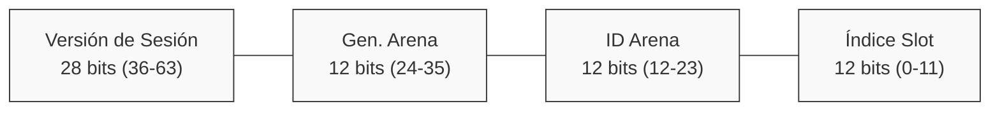
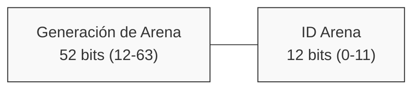
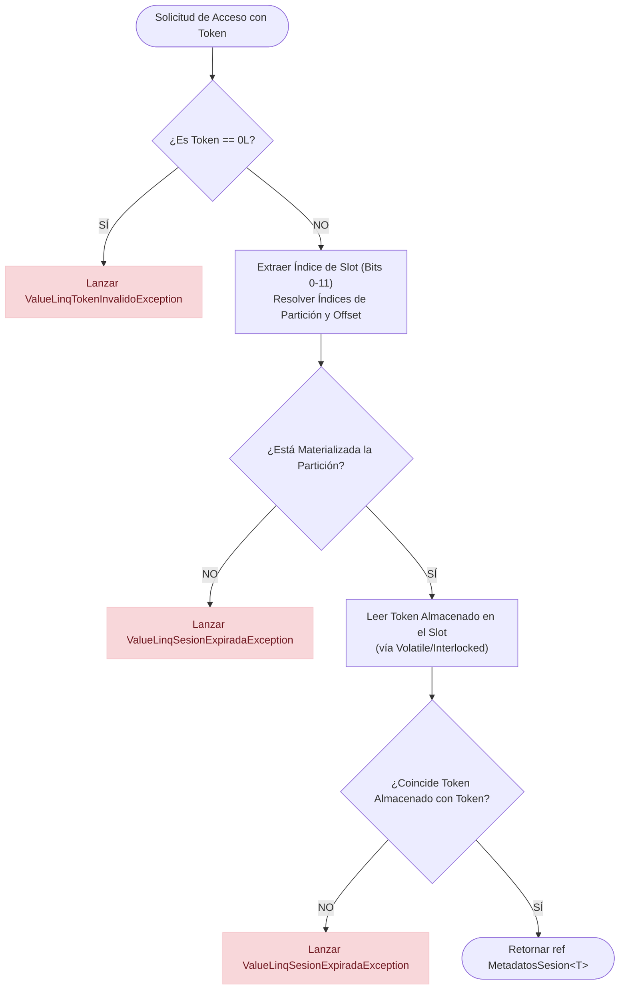

# Especificación de Arquitectura Core de ValueLINQ

Esta especificación proporciona una auditoría arquitectónica detallada del subsistema de memoria arena, la gestión de sesiones, las estructuras de tokens y los mecanismos de sincronización del subsistema de memoria de **ValueLINQ** en la biblioteca `JCarrillo.AOT.Core`.

---

## 1. Arquitectura del Subsistema de Memoria (Memory Arena)

El subsistema de memoria arena proporciona un pool pre-asignado de contextos de memoria virtualizados diseñados para aislar consultas y asignaciones de estado. El subsistema es gestionado por `ValueLINQArenaManager` y representado por `ValueLINQArena`.

### 1.1 Ciclo de Vida de Construcción e Inicialización
El estado de seguimiento global se inicializa de forma estática en el constructor estático de `ValueLINQArenaManager` (`ValueLINQArenaManager.cs:23-40`). 

* **Pre-Asignación**: El gestor asigna un array fijo `EstadoArena[] _arenas` de tamaño `ValueLINQConfig.Arenas` (4096 entradas) (`ValueLINQArenaManager.cs:11`, `ValueLINQConfig.cs:23`). Cada entrada rastrea el token del ciclo de vida, el contador de generación y la marca de tiempo del último acceso de una arena.
* **Arena Ambiental (Arena 0)**: Durante la construcción estática (`ValueLINQArenaManager.cs:35-39`), el ID de arena 0 se inicializa como la "Arena Ambiental". Sus propiedades se configuran como:
  * `Generacion = 1`
  * `IsPersistente = true`
  * `UltimoUso = Stopwatch.GetTimestamp()`
  * El `Token` se genera usando `TokenHelper.CrearTokenArena(0, 1)` y se almacena en `_arenas[0].Token` a través de `TokenHelper.EscribirToken`.
* **Buffer circular de reciclaje de IDs**: Un array `_idsLibres` de tamaño 4095 (que representa la capacidad del índice `ValueLINQConfig.Arenas - 1`) se rellena previamente con IDs del `1` al `4095` en orden ascendente (`ValueLINQArenaManager.cs:15`, `ValueLINQArenaManager.cs:28-29`). Los índices `_cabeza`, `_cola` y `_cuenta` se inicializan en `0`, `0` y `4095` respectivamente (`ValueLINQArenaManager.cs:31-33`).

### 1.2 Ciclo de Vida de Alquiler y Liberación
* **Alquilar una Arena (`Alquilar`)**: Cuando se invoca `ValueLINQArenaManager.Alquilar(bool persistente = false)` (`ValueLINQArenaManager.cs:48-67`), se adquiere el bloqueo (lock) del gestor global `_spinLock` (`ValueLINQArenaManager.cs:13`).
  1. El gestor verifica si `_cuenta > 0`. Si `_cuenta == 0`, lanza `InvalidOperationException` a través de `ThrowSinCapacidadArenas()` (`ValueLINQArenaManager.cs:43-46`).
  2. Se obtiene el siguiente ID disponible de `_idsLibres[_cabeza]`. El índice de la cabeza (head) se actualiza mediante `_cabeza = (_cabeza + 1) % _idsLibres.Length`, y se decrementa `_cuenta` (`ValueLINQArenaManager.cs:55-57`).
  3. El contador de generación del slot de la arena seleccionada se incrementa (`++estado.Generacion`) y se construye un token de arena de 64 bits (`ValueLINQArenaManager.cs:60`).
  4. El token se escribe atómicamente, se establece `IsPersistente` y se actualiza `UltimoUso` con la marca de tiempo actual (`ValueLINQArenaManager.cs:62-64`).
* **Liberar una Arena (`Liberar`)**: Cuando se llama a `ValueLINQArenaManager.Liberar(long tokenArena)` (`ValueLINQArenaManager.cs:69-114`):
  1. El ID de la arena se extrae del token mediante `TokenHelper.ObtenerIdTokenArena` (`ValueLINQArenaManager.cs:71`). Si el ID es 0, la operación retorna inmediatamente (`ValueLINQArenaManager.cs:73-74`).
  2. Dentro del `_spinLock`, el token activo almacenado en `_arenas[id].Token` se compara con el `tokenArena` proporcionado. Si coinciden, el token se reescribe como `0L` y `UltimoUso` se establece en `-1` (`ValueLINQArenaManager.cs:80-87`).
  3. Se invocan las limpiezas registradas (`_liberadores`) para el ID de arena liberado (`ValueLINQArenaManager.cs:95-105`).
  4. El ID se recicla de nuevo en el buffer circular en el índice `_cola` (`_cola = (_cola + 1) % _idsLibres.Length`), y se incrementa `_cuenta` (`ValueLINQArenaManager.cs:109-113`).

### 1.3 Persistencia de la Arena Ambiental
La Arena Ambiental (ID 0) nunca se recicla. Si se llama a `Liberar` con un token que representa el ID 0, el método sale inmediatamente sin liberar recursos (`ValueLINQArenaManager.cs:73-74`). Esto asegura que el contexto ambiental global permanezca permanentemente válido para asignaciones por defecto (no aisladas).

---

## 2. Gestión de Sesiones (TablaSesiones<T>)

Los buffers de sesión para cada tipo `T` son rastreados dentro de `TablaSesiones<T>` (`Arena/TablaSesiones.cs:10`). 

### 2.1 Materialización Bajo Demanda en ValueLINQStateManager<T>
La clase `ValueLINQStateManager<T>` mantiene un array de referencias estático `_tablas` de tamaño `ValueLINQConfig.Arenas` (4096) (`ValueLINQStateManager.cs:15`). 
* Al iniciar, solo se inicializa `_tablas[0]` (`ValueLINQStateManager.cs:19`).
* Para cualquier otro ID de arena, la instancia de `TablaSesiones<T>` se materializa bajo demanda dentro de `ObtenerOCrearTabla(idArena)` (`ValueLINQStateManager.cs:60-87`):
  1. Si `_tablas[idArena]` es nulo, el gestor lee la generación actual de la arena a través de `ValueLINQArenaManager.ObtenerGeneracion(idArena)` (`ValueLINQStateManager.cs:67`). Si es `0L`, se lanza `ValueLinqArenaInactivaException` (`ValueLINQStateManager.cs:69-70`).
  2. Se construye una nueva instancia de `TablaSesiones<T>` (`ValueLINQStateManager.cs:72`).
  3. La instancia se escribe en `_tablas[idArena]` a través de `Interlocked.CompareExchange` (`ValueLINQStateManager.cs:73`). Si otro hilo concurrente (racing thread) ya ha publicado una tabla, se conserva esa instancia y se descarta la nueva.
  4. Para garantizar la consistencia durante las liberaciones concurrentes, la generación se vuelve a verificar después de publicarla. Si la generación de la arena cambió, la tabla se limpia y se lanza `ValueLinqArenaInactivaException` (`ValueLINQStateManager.cs:78-84`).

### 2.2 Particionamiento de Slots y Disposición de Almacenamiento
Para minimizar la sobrecarga de asignación de memoria, `TablaSesiones<T>` divide sus 4096 slots de sesión en 64 particiones que contienen 64 slots cada una (`ValueLINQConfig.Particiones = 64`, `ValueLINQConfig.SlotsEnParticion = 64`, `ValueLINQConfig.cs:73`, `ValueLINQConfig.cs:78`).
* **Array de Metadatos**: `MetadatosSesion<T>[][] _datos` rastrea los metadatos de las sesiones (`Arena/TablaSesiones.cs:16`).
* **Array de Locks**: `SpinLockSlot[][] _spinLocks` proporciona sincronización a nivel de slot (`Arena/TablaSesiones.cs:17`).
* **Asignación Perezosa (Lazy) de Particiones**: Durante la construcción, solo se asignan los arrays de nivel superior de tamaño 64. Los sub-arrays de las particiones (`_datos[particion]` y `_spinLocks[particion]`) se inicializan como `null` (`Arena/TablaSesiones.cs:16-17`). Los sub-arrays se materializan de forma perezosa dentro de `PopIndice()` solo cuando un slot perteneciente a esa partición se extrae (pop) por primera vez (`Arena/TablaSesiones.cs:42-62`).

---

## 3. Decisiones de Diseño: LIFO vs FIFO

ValueLINQ implementa un modelo de indexación híbrido, combinando una pila LIFO (Último en Entrar, Primero en Salir) para los slots de sesión con una cola FIFO (Primero en Entrar, Primero en Salir) para los IDs de arena. 

| Subsistema | Estructura de Datos | Ubicación en el Código | Justificación de Ingeniería |
| :--- | :--- | :--- | :--- |
| **Slots de Sesión (`TablaSesiones<T>`)** | **Pila LIFO** | `_indicesLibresStack` (`Arena/TablaSesiones.cs:23`, `Arena/TablaSesiones.cs:32-72`) | 1. **Localidad de Caché**: Extraer (pop) e insertar (push) desde la parte superior de la pila (`--_topStack`, `_topStack++`) asegura que el slot liberado más recientemente se reutilice de inmediato. Esto aumenta la probabilidad de que los metadatos asociados (`MetadatosSesion<T>`) y los buffers de array alquilados permanezcan calientes en las cachés L1/L2 de la CPU.<br>2. **Materialización Perezosa**: Los slots se reciclan desde la parte superior. Las particiones inferiores (por ejemplo, particiones 1 a 63) nunca se materializan a menos que la aplicación experimente un pico de alta concurrencia. Esto evita asignar memoria para particiones no utilizadas. |
| **IDs de Arena (`ValueLINQArenaManager`)** | **Cola FIFO** | `_idsLibres` (`ValueLINQArenaManager.cs:15`, `ValueLINQArenaManager.cs:55-57`, `ValueLINQArenaManager.cs:110-112`) | 1. **Maximizar Ventana de Reciclaje ABA**: Las arenas representan límites de memoria virtual de larga duración. Reutilizar un ID de arena inmediatamente después de su eliminación aumenta el riesgo de colisión de tokens caducados. Al enrutar los IDs a través de una cola FIFO, un ID debe recorrer los otros 4094 IDs disponibles antes de volver a utilizarse.<br>2. **Balanceo de Carga de Asignaciones**: FIFO distribuye las asignaciones de manera uniforme a través de las estructuras de seguimiento del gestor, reduciendo la frecuencia de colisiones en limpiezas activas. |

---

## 4. Límites de los Tokens de Sesión de 64 bits

Para evitar asignar manejadores (handles) de sesión en el heap (heap-allocation), todo el estado de seguimiento se codifica en un único valor `long` de 64 bits.

### 4.1 Límites de Bits del Token de Sesión
Un token de sesión se construye utilizando `TokenHelper.CrearToken(slotIndex, arenaId, arenaGen, version)` (`TokenHelper.cs:40-41`). Los 64 bits están segmentados de la siguiente manera (los límites están definidos en `ValueLINQConfig.cs:18`, `ValueLINQConfig.cs:33`, `ValueLINQConfig.cs:43`, `ValueLINQConfig.cs:48`):



* **Bits 0 - 11 (12 bits) - Índice de Slot**: Identifica el índice del slot físico (0 a 4095) dentro de `TablaSesiones<T>` (`ValueLINQConfig.SlotBits = 12`).
* **Bits 12 - 23 (12 bits) - ID de Arena**: Identifica la arena propietaria (0 a 4095) (`ValueLINQConfig.ArenaBits = 12`).
* **Bits 24 - 35 (12 bits) - Gen. de Arena**: Almacena los 12 bits inferiores del contador de generación de la arena en el momento de la creación de la sesión (`ValueLINQConfig.ArenaGenBits = 12`).
* **Bits 36 - 63 (28 bits) - Versión de Sesión**: Rastreado localmente en cada slot. Se incrementa en cada operación de extracción (pop) (`ValueLINQConfig.VersionBits = 28`). Un bucle de reintento en `TablaSesiones<T>.ObtenerMetadatos(int tamañoMinimo)` (`Arena/TablaSesiones.cs:164-167`, véase la sección 6.1) es la garantía estructural que sostiene la invariante de la sección 5 de que `0L` nunca es un token de sesión válido, incluso cuando la versión de sesión desborda y vuelve a cero.

### 4.2 Límites de Bits del Token de Arena
Un token de arena representa la identidad y generación de una arena de memoria. Se crea utilizando `TokenHelper.CrearTokenArena(idArena, generacion)` (`TokenHelper.cs:107-108`). Su diseño es:



* **Bits 0 - 11 (12 bits) - ID de Arena**: Identifica la arena (0 a 4095).
* **Bits 12 - 63 (52 bits) - Generación de Arena**: Rastrea la generación del ciclo de vida de la arena, proporcionando hasta $4.5 \times 10^{15}$ generaciones antes de desbordarse.

---

## 5. Ciclo de Vida de Validación de Tokens

Cuando se solicita una estructura de metadatos de sesión activa utilizando un token de sesión (p. ej., dentro de `ObtenerMetadatos(long token)` en `Arena/TablaSesiones.cs:175-194`), la solicitud pasa por un proceso de validación secuencial:



1. **Validación de Nulos**: Si el token es `0L`, se clasifica como estructuralmente inválido, desencadenando `ValueLinqTokenInvalidoException` (`Arena/TablaSesiones.cs:177-178`).
2. **Particionamiento de Índices**: El índice del slot se extrae a través de `TokenHelper.ObtenerSlotIndex(token)`. El índice de la partición se calcula desplazando el índice del slot 6 bits a la derecha (`ValueLINQConfig.SlotsParticionBits = 6`), obteniendo un índice de partición cuya anchura es `ParticionBits = SlotBits - SlotsParticionBits = 6` (`ValueLINQConfig.cs:68`), y el offset del slot se resuelve mediante una operación AND a nivel de bit con `SlotsParticionMask` (63) (`Arena/TablaSesiones.cs:127-132`).
3. **Comprobación de Materialización**: Se evalúa la referencia de la partición `_datos[particion]`. Si es `null`, la partición nunca se materializó (lo que implica que la sesión expiró o nunca se creó), desencadenando `ValueLinqSesionExpiradaException` a través de `ThrowSesionNoEncontrada` (`Arena/TablaSesiones.cs:185-186`).
4. **Verificación de Identidad del Token**: El token almacenado dentro de `_datos[particion][index].Token` se lee utilizando barreras de memoria (`TokenHelper.LeerToken`). Si el token almacenado no coincide con el token solicitado, indica que el slot ha sido reciclado o limpiado, desencadenando `ValueLinqSesionExpiradaException` (`Arena/TablaSesiones.cs:190-191`).

---

## 6. Protección ABA

ValueLINQ implementa dos capas de validación distintas para prevenir el problema ABA (donde una referencia caducada se valida incorrectamente contra un slot reciclado que contiene nuevos datos).

### 6.1 Protección ABA Intra-Arena (Versionado de Sesión)
Debido a que el pool de slots se gestiona a través de una pila LIFO, un índice de slot $S$ se recicla rápidamente. Para evitar que los tokens caducados accedan a un slot reciclado:
1. Cada vez que se alquila un índice de slot en `ObtenerMetadatos(int tamañoMinimo)` (`Arena/TablaSesiones.cs:156-172`), el campo de versión en la estructura de metadatos se incrementa: `++metadato.Version` (`Arena/TablaSesiones.cs:166`).
2. El token de sesión recién generado incrusta esta versión incrementada en sus 28 bits superiores. La generación del token no es una única llamada, sino que está protegida por un bucle `do/while` en `ObtenerMetadatos(int tamañoMinimo)` (`Arena/TablaSesiones.cs:164-167`) que invoca `TokenHelper.CrearToken(indice, _arenaId, _arenaGen, ++metadato.Version)` y reintenta con la siguiente versión mientras el resultado sea `0L`. Este guard (introducido en el commit `ae6b39c`) evita que el desbordamiento de los 28 bits de versión —combinado con campos de slot, arena y generación cuyos bits normalizados sean cero— produzca el valor reservado `0L`, ya que `TokenHelper.CrearToken` (`TokenHelper.cs:42-43`) no incluye ninguna comprobación propia.
3. Cuando un hilo intenta acceder a la sesión utilizando un token caducado que contiene una versión anterior, la comprobación de coincidencia exacta (`TokenHelper.LeerToken(ref metadatoRef.Token) != token`) falla (`Arena/TablaSesiones.cs:190-191`), evitando el acceso a memoria inválida.

### 6.2 Protección ABA Inter-Arena (Generaciones de Arena)
Si se dispone de una arena y su ID es posteriormente reciclado por la cola FIFO del gestor, se podrían asignar nuevas sesiones con el mismo ID. Para evitar que los tokens antiguos crucen los límites de las arenas:
1. Cada vez que se alquila una arena, `ValueLINQArenaManager` incrementa el contador de generación global para ese ID (`++estado.Generacion`) (`ValueLINQArenaManager.cs:60`).
2. Los 12 bits inferiores de esta generación se incrustan en el token de sesión (`Gen. Arena` bits 24-35).
3. Los tokens de sesión caducados contienen la antigua generación de la arena. Durante la validación, `ValueLINQStateManager<T>` comprueba que la arena siga viva y que su generación coincida activamente: en `ObtenerTabla(long token)` e `IntentarObtenerTabla(long token)` se verifica que `ValueLINQArenaManager.IsArenaViva(idArena)` sea verdadero y, para arenas explícitas (`idArena != 0`), que `(int)(generacion & ValueLINQConfig.ArenaGenMask) == TokenHelper.ObtenerArenaGen(token)` y que la generación registrada en la tabla coincida; si cualquiera de estas condiciones falla (por ejemplo, tras el reciclaje del ID de arena en una nueva encarnación), se lanza inmediatamente `ValueLinqArenaInactivaException`. Adicionalmente, `ObtenerMetadatos(long tokenArena, int tamañoMinimo)` valida el token de arena de 64 bits completo verificando `ValueLINQArenaManager.IsArenaViva(tokenArena)` y `tabla.ArenaGen == generacion`. Si el ID ya fue realquilado por una nueva arena, cualquier sesión huérfana de la encarnación previa es rechazada tanto por la validación de generación del StateManager como por la comparación exacta de tokens en `TablaSesiones<T>.ObtenerMetadatos(long)` (`TokenHelper.LeerToken(ref metadatoRef.Token) != token`).
4. Adicionalmente, liberar una arena (`ValueLINQArenaManager.Liberar`, `ValueLINQArenaManager.cs:69-114`) invoca los liberadores registrados (`ValueLINQArenaManager.cs:95-105`); entre ellos, `ValueLINQStateManager<T>.LiberarTablasDeArena` (`ValueLINQStateManager.cs:137-138`, registrado en `ValueLINQStateManager.cs:22`) anula la tabla de la arena y llama a `TablaSesiones<T>.LiberarTodo`, que limpia completamente las entradas y establece sus tokens almacenados a `0L` (`Arena/TablaSesiones.cs:250`), invalidando todas las referencias.

---

## 7. Locks y Alineamiento de Caché de CPU

El acceso altamente concurrente a slots adyacentes requiere implementaciones de bloqueos (locks) especializadas y configuraciones de relleno (padding) para eliminar el uso compartido falso (*false sharing*).

### 7.1 ValueLINQSpinLock
La sincronización se implementa a través de `ValueLINQSpinLock` (`ValueLINQSpinLock.cs:5-24`).
* **Asignación en Stack**: Está declarado como un `ref struct`. Las reglas del compilador de C# obligan a que las instancias `ref struct` residan exclusivamente en la pila (stack). No pueden ser empaquetadas (boxed), escapar al heap ni ser capturadas en closures.
* **Patrón RAII**: Toma una referencia a un `System.Threading.SpinLock` y llama a `Enter` en su constructor, liberando el bloqueo mediante `Exit(useMemoryBarrier: true)` cuando se invoca `Dispose` (`ValueLINQSpinLock.cs:11-23`).

### 7.2 Alineamiento de Caché de CPU a 64 Bytes (Padding)
Las arquitecturas de CPU modernas recuperan e invalidan memoria en bloques llamados "líneas de caché", típicamente de 64 bytes de tamaño. Si variables modificadas por diferentes hilos ocupan la misma línea de caché, las escrituras en una variable invalidan la copia en caché de la otra, provocando una degradación de rendimiento conocida como *false sharing*.

Para evitar esto:
1. **Relleno de `SpinLockSlot`**: El struct está configurado con disposición secuencial y un tamaño forzado de 64 bytes (`SpinLockSlot.cs:6-10`):
   ```csharp
   [StructLayout(LayoutKind.Sequential, Size = 64)]
   internal struct SpinLockSlot
   {
       public SpinLock Lock;
   }
   ```
   Esto asegura que cada instancia de `SpinLock` en el array escalonado (jagged) `_spinLocks` resida en su propia línea de caché.
2. **Relleno de `MetadatosSesion<T>`**: El struct de metadatos se rellena con tres campos de 64 bits (`long Relleno1`, `Relleno2`, `Relleno3`) (`MetadatosSesion.cs:3-14`):
   ```csharp
   internal struct MetadatosSesion<T>
   {
       public long Token;          // 8 bytes
       public T[]? Array;          // 8 bytes
       public int TamañoActual;    // 4 bytes
       public bool IsDisposed;     // 1 byte
       // el compilador rellena 3 bytes aquí para alinear UltimoAcceso a límite de 8 bytes
       public long UltimoAcceso;   // 8 bytes
       public long Version;        // 8 bytes
       public long Relleno1;       // 8 bytes
       public long Relleno2;       // 8 bytes
       public long Relleno3;       // 8 bytes
   }
   ```
   Esta disposición de relleno (padding) eleva el tamaño total del struct a exactamente 64 bytes, asegurando que los elementos de metadatos de sesión adyacentes no compartan una línea de caché.

---

## 8. Prevención de Deadlocks

Cuando dos sesiones se fusionan (merge) a través de `Añadir(long token, long otroToken)` (`Arena/TablaSesiones.cs:516-558`), se deben adquirir los bloqueos (locks) de ambos slots. 
Para evitar condiciones de espera circular (*deadlocks*) donde el Hilo A bloquea el Slot X y espera al Slot Y, mientras el Hilo B bloquea el Slot Y y espera al Slot X, ValueLINQ implementa una regla de ordenamiento de índices ascendente:

```csharp
ref SpinLock
    minSL = ref ObtenerSpinLock(Math.Min(indice, otroIndice)),
    maxSL = ref ObtenerSpinLock(Math.Max(indice, otroIndice));

if (indice == otroIndice)
    using (new ValueLINQSpinLock(ref minSL))
        AñadirInterno(token, otroToken, ref arrayADevolver);
else
    using (new ValueLINQSpinLock(ref minSL))
    using (new ValueLINQSpinLock(ref maxSL))
        AñadirInterno(token, otroToken, ref arrayADevolver);
```

Al ordenar los índices usando `Math.Min` y `Math.Max` (`Arena/TablaSesiones.cs:545-546`), el orden de bloqueo se mantiene constante en todos los hilos. El bloqueo con el índice de slot menor siempre se adquiere primero, eliminando las dependencias de bloqueo circulares.

---

## 9. Subsistema de Excepciones

ValueLINQ define cuatro excepciones personalizadas en `JCarrillo.AOT.Core.ValueLINQ.Excepciones` para señalar violaciones del ciclo de vida. Todos los constructores de excepciones están decorados con `[MethodImpl(MethodImplOptions.NoInlining)]` para evitar el "inlining" en la ruta de ejecución caliente (hot-path).

1. **`ValueLinqArenaCruzadaException`** (`Excepciones/ValueLinqArenaCruzadaException.cs:14`):
   * *Condición de Disparo*: Lanzada cuando una consulta u operación intenta fusionar o procesar sesiones que pertenecen a dos arenas de memoria activas diferentes.
   * *Diseño*: Expone las propiedades de solo lectura `ArenaEsperada` y `ArenaEncontrada` para rastrear fugas entre arenas (cross-arena leaks) o uniones ilegales.
2. **`ValueLinqArenaInactivaException`** (`Excepciones/ValueLinqArenaInactivaException.cs:13`):
   * *Condición de Disparo*: Lanzada cuando se intenta una asignación o acceso a sesión sobre un ID de arena que ha sido liberado, nunca fue asignado, cuya generación ya no coincide con la encarnación activa, o al invocar `ToValueQuery` / `ToValueRefQuery` sobre una arena inactiva o `default(ValueLINQArena)`.
   * *Diseño*: Expone `IdArena` para identificar el contexto caducado.
3. **`ValueLinqSesionExpiradaException`** (`Excepciones/ValueLinqSesionExpiradaException.cs:15`):
   * *Condición de Disparo*: Lanzada cuando se accede a una sesión después de que su versión haya sido incrementada o su slot reciclado.
   * *Diseño*: Incluye `IdEsperado` (el token activo en el slot), `IdObtenido` (el token caducado presentado), y el `Indice` del slot para ayudar a la depuración.
4. **`ValueLinqTokenInvalidoException`** (`Excepciones/ValueLinqTokenInvalidoException.cs:14`):
   * *Condición de Disparo*: Lanzada cuando un token cero (`0L`) o un token estructuralmente malformado se presenta al gestor de sesiones.
   * *Diseño*: Expone `TokenObtenido` y el `IndiceMapeado` analizado.
