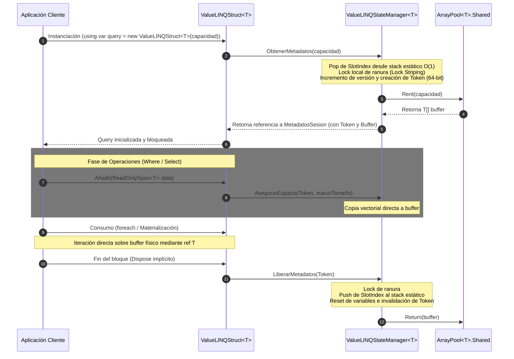

[Volver al Sitemap de Documentación](../README.md)

# ValueLINQ: Pipeline de Consultas Estructuradas con Cero Asignaciones y Compatibilidad Native AOT

ValueLINQ (versión 1.1.0) es un motor de procesamiento de consultas estructuradas de alto rendimiento para .NET, diseñado específicamente para entornos restrictivos como **Native AOT** y sistemas con latencia crítica que requieren **cero asignaciones en el Heap de GC** (0 bytes de allocation).

Este framework sustituye el comportamiento estándar de LINQ (basado en delegados asignados en el heap, boxing de enumeradores e invocaciones indirectas) por un modelo síncrono basado en structs (`ValueLINQStruct<T>` y `ValueLINQRefStruct<T>`) que operan sobre una tabla estática de estados controlada por `ValueLINQStateManager<T>`.

---

## 1. Metas de Diseño

El diseño de ValueLINQ se rige por tres restricciones arquitectónicas estrictas:

1. **Cero Asignaciones en el Heap (0 Bytes Allocated)**: Todos los estados de la consulta, enumeradores y filtros intermedios se almacenan en la pila (stack) como `ref struct` o `record struct`. Los buffers temporales se obtienen del pool de memoria del sistema (`ArrayPool<T>.Shared`) y se gestionan mediante el patrón de sesión determinista.
2. **Compatibilidad Nativa AOT (Native AOT Compliance)**: Exclusión absoluta de reflexión en tiempo de ejecución, emisión dinámica de código (`System.Reflection.Emit`) y genéricos JIT tardíos. Todos los tipos de filtros y selectores se resuelven de forma estática en tiempo de compilación mediante genéricos de estructura, lo que permite al compilador realizar inlining completo de la lógica de usuario.
3. **Seguridad Síncrona Estricta**: Aislamiento de concurrencia mediante un modelo segmentado de bloqueos (Lock Striping 1 a 1 por slot) y verificación de tokens de 64 bits para prevenir lecturas corruptas (torn reads), expiración de estados y fugas de memoria.

---

## 2. Características Principales del Motor de Consultas (Lanzamiento Inicial v1.1.0)

La versión inicial 1.1.0 de la biblioteca `JCarrillo.AOT.Core` marca el nacimiento y lanzamiento del motor **ValueLINQ**, implementando un entorno de procesamiento síncrono estructurado diseñado desde cero para .NET. Sus características fundamentales constan de:

*   **Gestion de Estados Centralizada (StateManager & Lock Striping)**: Administración física de buffers de memoria reutilizables mediante una tabla estática global de 4096 slots. Para evitar la contención de hilos en escenarios concurrentes, implementa un modelo de **Lock Striping 1 a 1** (un objeto lock exclusivo por slot) y un asignador de ranuras libres en tiempo constante $O(1)$ basado en un stack estático (`_indicesLibresStack`), eliminando escaneos lineales y esperas probabilísticas.
*   **Tokens de Seguridad de 64 bits**: Helper atómico `TokenHelper` que codifica la versión incremental y el índice físico de slot en un entero `long` de 64 bits. Implementa accesos volátiles y atómicos seguros de hardware (con soporte híbrido mediante `Interlocked` en arquitecturas de 32 bits), previniendo lecturas fragmentadas (torn reads) y resolviendo accesos simultáneos sin bloqueos en la ruta caliente.
*   **Operadores Fluent Síncronos y Cero Asignaciones**: Soporte para operadores estructurados (`Where`, `Select`, `Concat`) implementados directamente sobre `ValueLINQStruct<T>` y `ValueLINQRefStruct<T>`. Utilizan restricciones de estructura genérica (`where TDelegado : struct`) para habilitar el inlining agresivo por parte del compilador JIT y garantizar **0 bytes de asignación (medido)** en el Heap de GC.
*   **Enumeradores Estructurales Directos**: Enumeración ultrarrápida a velocidad de hardware mediante el `ref struct` `ValueLINQEnumerator<T>`, recuperando el Span del búfer una sola vez al inicio del bucle `foreach` y devolviendo los elementos por referencia (`ref T`) para evitar copias costosas.
*   **Población en Bloque (Bulk Population)**: Transferencia vectorial masiva de datos a nivel físico mediante `Añadir(ReadOnlySpan<T>)` y `Span.CopyTo`, amortizando la sincronización del StateManager a una única operation al inicio de la carga de datos.
*   **Materialización y Caching de Largo Ciclo de Vida**: Operadores de materialización (`ToList()`, `ToArray()`, `ToListRef()`, `ToArrayRef()`) que copian en bloque hacia colecciones rápidas de ciclo de vida prolongado (`PooledList<T>`, `PooledArray<T>`) y liberan inmediatamente el búfer transitorio en el StateManager, previniendo excepciones de expiración por parte del limpiador de fondo.
*   **Operador de Particionamiento (Chunking)**: Implementación de `Chunk` y `ProcessChunks` sin asignaciones en el montón. Divide colecciones lógicas almacenando cada fragmento como un struct `ValueLINQStruct<T>` directamente en un contenedor de pila `ValueLINQRefStruct<ValueLINQStruct<T>>` (o `ValueLINQStruct<ValueLINQStruct<T>>`), garantizando total seguridad de tipos en compilación.
*   **Robustez y Seguridad ante Excepciones (Rollback Atómico)**: Envoltura sistemática de todos los pipelines de datos intermedios en bloques `try-finally`. Si ocurre una excepción en medio de la población, segmentación o procesamiento de datos, los operadores realizan un rollback ordenado: liberan cada búfer parcial instanciado y devuelven el contenedor al pool de forma inmediata, evitando cualquier riesgo de fuga de búferes en el `ArrayPool`.
 
## Limitaciones y Compromisos de Diseño del Motor de Consultas
 
De acuerdo con el estándar de ingeniería honesta, se declaran los siguientes límites físicos y compromisos de diseño asociados a la versión inicial de ValueLINQ:
 
1.  **Hard Cap de Sesiones Activas Concurrentes**: El StateManager está limitado físicamente a un máximo estricto de **4096 ranuras de sesión activas (medido)** en toda la aplicación. Si se alcanza este límite de concurrencia simultánea, las nuevas solicitudes de consulta fallarán o se verán bloqueadas hasta que se liberen slots existentes.
2.  **Contención Menor del Asignador**: El stack estático de ranuras libres se gestiona bajo un bloqueo síncrono exclusivo global (`_stackRoot`). Aunque esta operación dura apenas nanosegundos (un simple ajuste de índice), representa un cuello de botella de contención teórico bajo cargas extremas de concurrencia en la fase de inicialización.
3.  **Degradación Menor en Sistemas de 32 bits**: La atómica de 64 bits en sistemas x86, ARM32 o Wasm32 requiere operaciones de hardware más pesadas a través de `Interlocked.Read` e `Interlocked.Exchange` en `TokenHelper`, lo que introduce una penalización menor de latencia en comparación con el acceso directo a memoria disponible en sistemas de 64 bits.
4.  **Dependencia Estricta del Dispose**: Para evadir asignaciones en el Heap y reciclar los búferes, ValueLINQ delega la responsabilidad de la liberación al código cliente. Si el desarrollador no invoca `Dispose()` (o no emplea bloques `using`), la devolución del búfer al `ArrayPool` se retrasará hasta que se active el limpiador periódico de fondo (**5 minutos (medido)** de inactividad), provocando un incremento temporal en el consumo de memoria física (Working Set) del proceso.

---

## 3. Esquema de Arquitectura

El flujo de ejecución síncrono de ValueLINQ desacopla la API del usuario del almacenamiento físico de los datos mediante el siguiente esquema de comunicación:

### Componentes Clave:
*   **[Núcleo y Arquitectura (Core)](Core/README.md)**: Estructura interna, modelos de sesión y gestor de estados centralizado.
    *   **[ValueLINQStructs: Modelos de Sesión](Core/ValueLINQStructs.md)**: Diferencias, ciclo de vida y reglas de pila de `ValueLINQStruct` y `ValueLINQRefStruct`.
    *   **[ValueLINQStateManager: Gestor y Sincronización](Core/ValueLINQStateManager.md)**: Análisis del gestor estático de 4096 slots, lock striping y el timer de limpieza de fondo.
*   **[Métodos y Extensiones (Operadores)](Metodos/README.md)**: Guía de referencia para el pipeline de operadores de consulta fluent (`Where`, `Select`, `Concat`, `Chunk` y materializadores de caching como `ToList` y `ToArray`).
*   **[Reporte de Benchmarks Completo](BENCHMARK.md)**: Comparativa analítica detallada de todos los tiempos que contrasta el rendimiento de ValueLINQ frente a LINQ estándar y colecciones de .NET en JIT y Native AOT.

