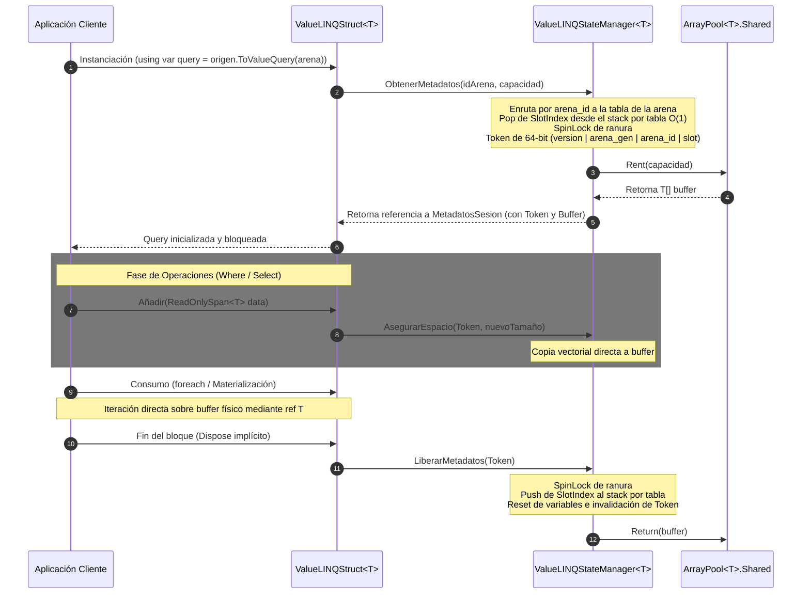
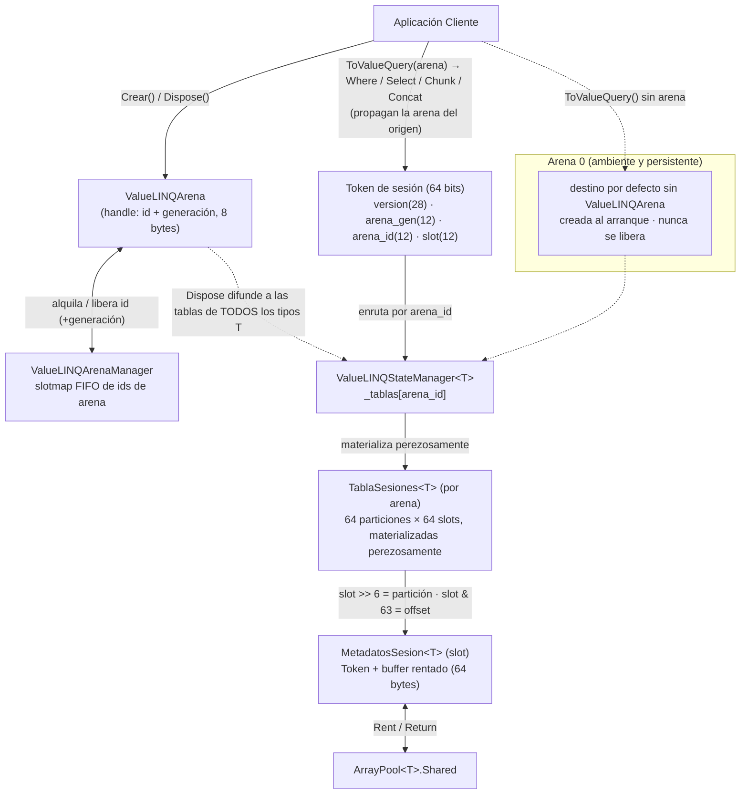

[Volver al Sitemap de Documentación](../README.md)

# ValueLINQ: Pipeline de Consultas Estructuradas con Cero Asignaciones y Compatibilidad Native AOT

ValueLINQ (versión publicada más reciente: 1.1.2; este documento describe además la versión en desarrollo con arenas de memoria, aún sin publicar) es un motor de procesamiento de consultas estructuradas de alto rendimiento para .NET, diseñado específicamente para entornos restrictivos como **Native AOT** y sistemas con latencia crítica que requieren **cero asignaciones en el Heap de GC** (0 bytes de allocation).

Este framework sustituye el comportamiento estándar de LINQ (basado en delegados asignados en el heap, boxing de enumeradores e invocaciones indirectas) por un modelo síncrono basado en structs (`ValueLINQStruct<T>` y `ValueLINQRefStruct<T>`) que operan sobre tablas de sesión particionadas por (tipo `T`, arena) gestionadas por `ValueLINQStateManager<T>`.

---

## 1. Metas de Diseño

El diseño de ValueLINQ se rige por tres restricciones arquitectónicas estrictas:

1. **Cero Asignaciones en el Heap (0 Bytes Allocated)**: Todos los estados de la consulta, enumeradores y filtros intermedios se almacenan en la pila (stack) como `ref struct` o `record struct`. Los buffers temporales se obtienen del pool de memoria del sistema (`ArrayPool<T>.Shared`) y se gestionan mediante el patrón de sesión determinista.
2. **Compatibilidad Nativa AOT (Native AOT Compliance)**: Exclusión absoluta de reflexión en tiempo de ejecución, emisión dinámica de código (`System.Reflection.Emit`) y genéricos JIT tardíos. Todos los tipos de filtros y selectores se resuelven de forma estática en tiempo de compilación mediante genéricos de estructura, lo que permite al compilador realizar inlining completo de la lógica de usuario.
3. **Seguridad Síncrona Estricta**: Aislamiento de concurrencia mediante un `SpinLock` por slot (struct `SpinLockSlot` alineado a 64 bytes contra el false sharing) y verificación de tokens de 64 bits para prevenir lecturas corruptas (torn reads), expiración de estados y fugas de memoria.

---

## 2. Características Principales del Motor de Consultas

La versión inicial 1.1.0 de la biblioteca `JCarrillo.AOT.Core` marca el nacimiento y lanzamiento del motor **ValueLINQ**, implementando un entorno de procesamiento síncrono estructurado diseñado desde cero para .NET. Para no mezclar capacidades liberadas con trabajo en curso, sus características se separan en dos bloques: lo publicado en los releases v1.1.0–v1.1.2 y lo que existe únicamente en la rama de desarrollo.

### Publicado en v1.1.0–v1.1.2

*   **Gestión de Estados Centralizada (StateManager)**: Administración física de buffers de memoria reutilizables mediante una tabla estática única de 4096 slots por tipo `T`. Para evitar la contención de hilos, implementa lock striping 1 a 1 (un objeto `lock` por slot) y un asignador de ranuras libres en $O(1)$ basado en un stack estático de índices libres, eliminando escaneos lineales y esperas probabilísticas.
*   **Tokens de Seguridad de 64 bits**: Helper atómico `TokenHelper` que codifica en un entero `long` de 64 bits la versión incremental de la sesión y el índice físico de slot (12 bits). Implementa accesos volátiles y atómicos seguros de hardware (con soporte híbrido mediante `Interlocked` en arquitecturas de 32 bits), previniendo lecturas fragmentadas (torn reads) y resolviendo accesos simultáneos sin bloqueos en la ruta caliente.
*   **Operadores Fluent Síncronos y Cero Asignaciones**: Soporte para operadores estructurados (`Where`, `Select`, `Concat`) implementados directamente sobre `ValueLINQStruct<T>` y `ValueLINQRefStruct<T>`. Utilizan restricciones de estructura genérica (`where TDelegado : struct`) para habilitar el inlining agresivo por parte del compilador JIT y garantizar **0 bytes de asignación (medido)** en el Heap de GC.
*   **Enumeradores Estructurales Directos**: `GetEnumerator` de `ValueLINQStruct<T>` y `ValueLINQRefStruct<T>` devuelve directamente el `Span<T>.Enumerator` del búfer de la sesión, recuperando el `Span` una sola vez al inicio del bucle `foreach` y entregando los elementos por referencia (`ref T`) para evitar copias. Al ser el enumerador del propio `Span`, el motor eager permite además **modificar los elementos en su sitio** durante el recorrido.
*   **Población en Bloque (Bulk Population)**: Transferencia vectorial masiva de datos a nivel físico mediante `Añadir(ReadOnlySpan<T>)` y `Span.CopyTo`, amortizando la sincronización del StateManager a una única operation al inicio de la carga de datos.
*   **Materialización y Caching de Largo Ciclo de Vida**: Operadores de materialización (`ToList()`, `ToArray()`, `ToListRef()`, `ToArrayRef()`) que copian en bloque hacia colecciones rápidas de ciclo de vida prolongado (`PooledList<T>`, `PooledArray<T>`) y liberan inmediatamente el búfer transitorio en el StateManager, previniendo excepciones de expiración por parte del limpiador de fondo.
*   **Operador de Particionamiento (Chunking)**: Implementación de `Chunk` y el método canónico `ProcesarChunks` sin asignaciones en el montón, complementado por el alias retrocompatible `ProcessChunks` (marcado como `[Obsolete("Use ProcesarChunks en su lugar", false)]` y con eliminación definitiva programada para v2.0.0). Divide colecciones lógicas almacenando cada fragmento como un struct `ValueLINQStruct<T>` directamente en un contenedor de pila `ValueLINQRefStruct<ValueLINQStruct<T>>` (ambas sobrecargas de `Chunk` devuelven este contenedor; `ProcesarChunks` acepta además contenedores `ValueLINQStruct<ValueLINQStruct<T>>` construidos manualmente), garantizando total seguridad de tipos en compilación.
*   **Robustez y Seguridad ante Excepciones (Rollback Atómico)**: Envoltura sistemática de todos los pipelines de datos intermedios en bloques `try-finally`. Si ocurre una excepción en medio de la población, segmentación o procesamiento de datos, los operadores realizan un rollback ordenado: liberan cada búfer parcial instanciado y devuelven el contenedor al pool de forma inmediata, evitando cualquier riesgo de fuga de búferes en el `ArrayPool`.

### En desarrollo (rama `feature/valuelinq-arena`, sin publicar)

Las siguientes capacidades arquitectónicas existen únicamente en la rama de trabajo actual y **no están incluidas en ningún release publicado**:

*   **Tablas de Sesión Particionadas por (tipo `T`, arena)**: Sustitución de la tabla plana única por tablas de sesión particionadas por (tipo `T`, arena) (64 particiones × 64 slots = 4096) con materialización perezosa de particiones y un stack de índices libres por tabla (`_indicesLibresStack`, protegido por `_spinLockStack`).
*   **Token Extendido con Generación de Arena (28/12/12/12)**: Ampliación del token de 64 bits para codificar la versión incremental (28 bits), la generación de arena (12), el id de arena (12) y el índice físico de slot (12), habilitando el enrutado por arena sin búsquedas ni diccionarios.
*   **Blindaje de Aislamiento en ToValueQuery / ToValueRefQuery**: Validación estricta de `arena.IsViva`, rechazo de `default(ValueLINQArena)` lanzando `ValueLinqArenaInactivaException` e impidiendo degradaciones silenciosas a la arena ambiente, junto con la propagación del `TokenArena` de 64 bits y comprobación generacional en el `StateManager`.
*   **Igualdad por Valor y Telemetría en ValueLINQArena**: `ValueLINQArena` implementa `IEquatable<ValueLINQArena>`, operadores `==` y `!=`, `Equals(object?)` sin boxing en el heap, `GetHashCode()` y expone la propiedad pública `public int Id { get; }` para telemetría.
*   **Sobrecargas de Entrada para Colecciones**: Nuevas sobrecargas con `ValueLINQArena` para `Span<T>`, `ReadOnlySpan<T>`, `Memory<T>`, `PooledList<T>`, `PooledArray<T>`, y sobrecargas simétricas sin arena para `PooledArray<T>`.
*   **`SpinLockSlot` por Ranura**: Sustitución de los objetos `lock` por slot por un `SpinLock` por ranura (struct `SpinLockSlot` alineado a 64 bytes contra el false sharing).
*   **Arenas de Memoria (`ValueLINQArena` / `ValueLINQArenaManager`)**: Ámbitos de memoria explícitos para liberar sesiones en bloque, con la arena 0 como arena ambiente y persistente. Ver [Arenas de Memoria](Core/Arenas.md).
 
## Limitaciones y Compromisos de Diseño del Motor de Consultas
 
De acuerdo con el estándar de ingeniería honesta, se declaran los siguientes límites físicos y compromisos de diseño asociados a la versión inicial de ValueLINQ:
 
1.  **Hard Cap de Sesiones Activas Concurrentes**: El StateManager está limitado a un máximo estricto de **4096 ranuras de sesión activas (medido)** por cada par (tipo `T`, arena); hay hasta 4096 arenas direccionables. Al alcanzar el límite de un par (tipo, arena), sus nuevas solicitudes fallarán o se bloquearán hasta liberar slots existentes. Ver [Arenas de Memoria](Core/Arenas.md).
2.  **Contención Menor del Asignador**: El stack de ranuras libres de cada tabla (`_indicesLibresStack`) se gestiona bajo un `SpinLock` de instancia (`_spinLockStack`), aislando la contención por (tipo `T`, arena). Aunque esta operación dura apenas nanosegundos (un simple ajuste de índice), representa un cuello de botella de contención teórico bajo cargas extremas de concurrencia en la fase de inicialización.
3.  **Degradación Menor en Sistemas de 32 bits**: La atómica de 64 bits en sistemas x86, ARM32 o Wasm32 requiere operaciones de hardware más pesadas a través de `Interlocked.Read` e `Interlocked.Exchange` en `TokenHelper`, lo que introduce una penalización menor de latencia en comparación con el acceso directo a memoria disponible en sistemas de 64 bits.
4.  **Dependencia Estricta del Dispose**: Para evadir asignaciones en el Heap y reciclar los búferes, ValueLINQ delega la responsabilidad de la liberación al código cliente. Si el desarrollador no invoca `Dispose()` (o no emplea bloques `using`), la devolución del búfer al `ArrayPool` se retrasará hasta que se active el limpiador periódico de fondo (**5 minutos (medido)** de inactividad), provocando un incremento temporal en el consumo de memoria física (Working Set) del proceso.
5.  **Requisito de Plataforma para el Motor Delay**: El motor diferido (Delay) requiere estrictamente .NET 9.0 y C# 13 o superior, debido a la dependencia de la restricción de lenguaje `allows ref struct`. En compilaciones para .NET 8.0 (incluido NativeAOT 8.0), el motor Delay no forma parte de la superficie pública de la biblioteca: todos sus tipos y métodos de extensión se excluyen mediante compilación condicional (`#if NET9_0_OR_GREATER`), por lo que cualquier referencia a la API Delay produce un error de compilación en el proyecto consumidor, no una excepción en tiempo de ejecución. La `PlatformNotSupportedException` registrada bajo .NET 8.0 en los reportes de rendimiento procede de los guardas del propio proyecto de benchmarks (`ValueLINQDelayComparisonBenchmarks`), no de la biblioteca.

---

## 3. Guía de Recomendaciones y Selección de Motor

### 3.1 Selección de Motor por Runtime (.NET 9+ vs .NET 8.0)
- **Bajo .NET 9.0 o superior**: Se recomienda utilizar **`ValueLINQ Delay`** (`ToValueDelayQuery`). Dado que este motor realiza la canalización diferida síncrona en stack, ofrece la menor latencia media y opera con cero asignaciones persistentes en el heap.
- **Bajo .NET 8.0**: El motor ansioso (**`ValueLINQ Eager`** - `ToValueQuery`) es el motor predeterminado y el único fallback operativo, ya que `Delay` no está disponible en este runtime debido a la ausencia de soporte de C# 13 para la restricción `allows ref struct`.

### 3.2 Regla de Selección por Tamaño de Colección (en .NET 8.0)
- **Colecciones con N <= 100 elementos**: Se recomienda usar **LINQ estándar del sistema**, excepto si la aplicación requiere de forma estricta una garantía de cero asignaciones en el heap de GC. A esta escala de elementos, el tiempo de inicialización (alquiler de slots en el `StateManager` y sincronización por bloqueos) puede superar la latencia de asignación del iterador de LINQ estándar.
- **Colecciones con N > 100 elementos**: Se recomienda migrar a **`ValueLINQ Eager`** (`ToValueQuery` / `ToValueRefQuery`), donde las optimizaciones de inlining de structs y la copia vectorial consolidada amortizan el coste de inicialización, reduciendo la latencia frente a LINQ estándar y manteniendo un perfil de asignaciones de 0 B **(medido)**.

### 3.3 Recomendación para Rutas No Calientes (Cold Paths) y Colecciones Pequeñas
- **Para el motor Eager (ValueLINQ Eager)**: Se debe evitar su uso en rutas de ejecución frías de la aplicación (por ejemplo: carga de configuración inicial, constructores de servicios de ejecución única o inicializaciones de setup). El LINQ tradicional de la plataforma es preferible en estos escenarios para evitar el consumo de slots en la tabla de 4096 posiciones por (tipo `T`, arena) del StateManager (cuyas particiones se materializan de forma perezosa) y la sobrecarga de sincronización del pool.
- **Para el motor Delay (ValueLINQ Delay)**: Su uso es seguro y recomendado tanto en rutas frías como en colecciones de tamaño reducido. Los pipelines de `Where`/`Select` creados directamente desde arrays o spans (`ToValueDelayQuery` sobre `T[]`, `Span<T>` o `ReadOnlySpan<T>`) no reservan slots en el StateManager, no adquieren bloqueos síncronos ni realizan asignaciones en el heap de GC, por lo que no presentan penalizaciones por inicialización. Existen dos excepciones: los pipelines originados en una sesión Eager (`ToValueDelayQuery` o `Delay()` sobre `ValueLINQStruct`/`ValueLINQRefStruct`) leen y validan la sesión de origen a través del StateManager en su construcción y en cada `MoveNext` (sin reservar slots nuevos) y la liberan al finalizar (`Dispose` adquiere los bloqueos del slot); y el operador `Chunk` del motor Delay sí reserva una sesión en el StateManager con un buffer rentado del `ArrayPool`, adquiriendo sus bloqueos `SpinLock` durante la construcción.

### 3.4 Garantía de Alocación del Motor Delay
- `ValueLINQ Delay` mantiene un perfil de **0 B de asignación en el heap de GC** en su ruta principal. `ValueLINQDelayStruct` y los enumeradores de `Where`/`Select` son estructuras de referencia (`ref struct`) asignadas en el stack que, cuando el origen es un array o span, no interactúan con el StateManager ni alquilan buffers temporales durante su creación, resolviendo el flujo de datos en la pila de llamadas. Los pipelines originados en una sesión Eager interactúan con el StateManager para validar y liberar la sesión de origen (sin reservar slots nuevos ni rentar buffers adicionales), y el operador `Chunk` constituye la excepción: su enumerador (`ValueLINQChunkDelay`) reserva un slot de sesión y alquila un buffer del `ArrayPool` en su construcción, liberándolos al agotar el flujo o mediante `Dispose`.

### 3.5 Recomendación de Ergonomía en Desarrollo (.NET 9+)
- Para el desarrollo diario en entornos `.NET 9.0` o superiores, se plantea la recomendación de desactivar las reglas de diagnóstico **`JCA0001`** (cierres y delegados Func) y **`JCA0002`** (materialización estándar con allocations) a nivel de archivo de proyecto (`.csproj`) o solución (`.editorconfig`).
- Esta configuración permite a los desarrolladores escribir consultas utilizando la sintaxis lambda convencional, eludiendo las advertencias continuas del compilador. Debe tenerse en cuenta que los materializadores estándar públicos (`ToArrayStandard()` y `ToListStandard()`) pertenecen exclusivamente al motor Eager (`ValueLINQStruct<T>` / `ValueLINQRefStruct<T>`); en la versión actual, los materializadores del motor Delay (`ToList`, `ToArray`, `ToListStandard`, `ToArrayStandard` sobre `ValueLINQDelayStruct<T, TEnumerator>`) son `internal` (visibles únicamente para los ensamblados de Tests y Benchmarks mediante `InternalsVisibleTo`), por lo que un consumidor externo del paquete debe consumir los pipelines Delay mediante enumeración directa (`foreach`) o `ProcesarChunk`, conservando así la menor latencia de ejecución del motor `ValueLINQ Delay` frente al LINQ tradicional del sistema.

---

## Estado del Proyecto y Hoja de Ruta

Esta sección separa de forma explícita **lo que la biblioteca hace hoy** (medido y publicado) de **las direcciones de diseño que se exploran**, para no mezclar capacidades reales con intenciones futuras.

### Publicado (v1.1.0–v1.1.2)

*   **Infraestructura del Núcleo y Operadores Iniciales**: El lanzamiento inicial v1.1.0 se enfocó estrictamente en establecer la infraestructura de núcleo de alto rendimiento (tabla plana única de 4096 slots por tipo `T`, con bloqueos por slot y tokens de sesión que codifican únicamente versión incremental y slot, sin arenas), la sincronización y bloqueos de StateManager, la seguridad de tokens y los operadores fundacionales de filtrado (`Where`) y proyección (`Select`), en lugar de buscar la paridad completa de operadores de LINQ estándar.
*   **Rutas Disponibles**: Se implementan tanto la ruta Eager (basada en buffers alquilados de `ArrayPool` y structs predicado) como la ruta Lazy/Diferida (Delay) que opera en pila sin asignaciones intermitentes. Adicionalmente, se ofrecen las sobrecargas ergonómicas que aceptan delegados de tipo `Func`.
*   **Perfil de asignación**: La ruta con structs delegados y la ruta Lazy con structs operan con **0 B (medido)** en el Heap de GC. La ruta ergonómica basada en expresiones lambda puede alocar memoria en función de la captura de clausuras (152 B **(medido)** con capturas de variables locales vs 0 B **(medido)** con lambdas estáticas).

### En desarrollo (sin publicar)

Las siguientes capacidades existen únicamente en la rama de trabajo `feature/valuelinq-arena` y **no están incluidas en ningún release publicado**:

*   **Arenas de Memoria**: Ámbitos de memoria explícitos (`ValueLINQArena` / `ValueLINQArenaManager`) con la arena 0 como arena ambiente y persistente, para liberar sesiones en bloque.
*   **Token con Generación de Arena (28/12/12/12)**: Ampliación del token de 64 bits para codificar versión incremental (28 bits), generación de arena (12), id de arena (12) y slot (12).
*   **Tablas Particionadas y `SpinLockSlot`**: Tablas de sesión particionadas por (tipo `T`, arena) (64 particiones × 64 slots) con materialización perezosa de particiones y un `SpinLock` por ranura (struct `SpinLockSlot` alineado a 64 bytes).

### Taxonomía de Asignación

| Ruta | ¿Zero-Allocation? | Estado |
| :--- | :---: | :--- |
| **Eager + delegado struct** | **Sí** (0 B) | Publicada (v1.1.0) |
| **Lazy/Diferida + delegado struct** | **Sí** (0 B, sin buffers intermedios) | Publicada / Soportada (v1.1.0) |
| **Delegados `Func`/`Action`** | **No** (depende del tipo de lambda / clausura) | Publicada / Soportada (v1.1.0) |

### Hoja de Ruta de Desarrollo

Como planes de desarrollo futuros se plantean las siguientes propuestas de optimización y expansión:

1.  **Ampliación de Cobertura de Operadores**: Se propone expandir la API para dar soporte a operadores adicionales como `GroupBy`, `OrderBy` y `Distinct` tanto en el motor Eager como en el motor Lazy/Diferida (Delay), incluyendo sus correspondientes sobrecargas ergonómicas con lambdas.
    - *Trade-off*: Incrementaría la base de código a mantener y la complejidad del inlining genérico del compilador JIT/AOT.
2.  **Optimización de Interceptores de Compilador**: Se plantea el desarrollo de un generador de código que reemplace automáticamente lambdas ergonómicas por structs dedicados en tiempo de compilación.
    - *Trade-off*: Aumentaría los tiempos de compilación del proyecto y la complejidad del sistema de compilación.

> [!WARNING]
> **Intención de Desarrollo, no Compromiso de Entrega**:
> Las direcciones descritas en esta sección son **propuestas de diseño sujetas a medición empírica y viabilidad técnica**. No constituyen un compromiso de release, ni una garantía de implementación, ni un calendario. Únicamente la sección «Publicado (v1.1.0–v1.1.2)» describe capacidades realmente publicadas y medidas; las capacidades listadas en «En desarrollo (sin publicar)» y cualquier funcionalidad futura se consideran trabajo en curso o propuestas, sin release asociado.

---

## 4. Esquema de Arquitectura

El flujo de ejecución síncrono de ValueLINQ desacopla la API del usuario del almacenamiento físico de los datos mediante el siguiente esquema de comunicación:

```mermaid
sequenceDiagram
    autonumber
    participant App as Aplicación Cliente
    participant VS as ValueLINQStruct<T>
    participant SM as ValueLINQStateManager<T>
    participant AP as ArrayPool<T>.Shared

    App->>VS: Instanciación (using var query = origen.ToValueQuery(arena))
    VS->>SM: ObtenerMetadatos(idArena, capacidad)
    Note over SM: Enruta por arena_id a la tabla de la arena<br/>Pop de SlotIndex desde el stack por tabla O(1)<br/>SpinLock de ranura<br/>Token de 64-bit (version | arena_gen | arena_id | slot)
    SM->>AP: Rent(capacidad)
    AP-->>SM: Retorna T[] buffer
    SM-->>VS: Retorna referencia a MetadatosSesion (con Token y Buffer)
    VS-->>App: Query inicializada y bloqueada

    rect rgb(120, 120, 120)
        Note over App, VS: Fase de Operaciones (Where / Select)
        App->>VS: Añadir(ReadOnlySpan<T> data)
        VS->>SM: AsegurarEspacio(Token, nuevoTamaño)
        Note over SM: Copia vectorial directa a buffer
    end

    App->>VS: Consumo (foreach / Materialización)
    Note over App, VS: Iteración directa sobre buffer físico mediante ref T

    App->>VS: Fin del bloque (Dispose implícito)
    VS->>SM: LiberarMetadatos(Token)
    Note over SM: SpinLock de ranura<br/>Push de SlotIndex al stack por tabla<br/>Reset de variables e invalidación de Token
    SM->>AP: Return(buffer)
```

### Capa de Arenas: Enrutado por Token

Sobre el flujo anterior se asienta la capa de **arenas de memoria**. El identificador de arena viaja dentro del propio token de sesión, de modo que cada operación se enruta —sin búsquedas ni diccionarios— a la tabla de sesiones de su arena. La arena 0 es ambiente y persistente (destino por defecto de las consultas sin arena); las arenas explícitas se crean y disponen con `ValueLINQArena`. Ver [Arenas de Memoria](Core/Arenas.md).

```mermaid
flowchart TD
    App["Aplicación Cliente"]
    Arena["ValueLINQArena<br/>(handle: id + generación, 8 bytes)"]
    AM["ValueLINQArenaManager<br/>slotmap FIFO de ids de arena"]
    Token["Token de sesión (64 bits)<br/>version(28) · arena_gen(12) · arena_id(12) · slot(12)"]
    SM["ValueLINQStateManager&lt;T&gt;<br/>_tablas[arena_id]"]
    Tabla["TablaSesiones&lt;T&gt; (por arena)<br/>64 particiones × 64 slots, materializadas perezosamente"]
    Slot["MetadatosSesion&lt;T&gt; (slot)<br/>Token + buffer rentado (64 bytes)"]
    AP["ArrayPool&lt;T&gt;.Shared"]

    App -->|"Crear() / Dispose()"| Arena
    Arena <-->|"alquila / libera id (+generación)"| AM
    App -->|"ToValueQuery(arena) → Where / Select / Chunk / Concat<br/>(propagan la arena del origen)"| Token
    Token -->|"enruta por arena_id"| SM
    SM -->|"materializa perezosamente"| Tabla
    Tabla -->|"slot &gt;&gt; 6 = partición · slot &amp; 63 = offset"| Slot
    Slot <-->|"Rent / Return"| AP
    Arena -.->|"Dispose difunde a las tablas de TODOS los tipos T"| SM

    subgraph Ambiente["Arena 0 (ambiente y persistente)"]
        A0["destino por defecto sin ValueLINQArena<br/>creada al arranque · nunca se libera"]
    end
    App -.->|"ToValueQuery() sin arena"| A0
    A0 -.-> SM
```

### Componentes Clave:
*   **[Núcleo y Arquitectura (Core)](Core/README.md)**: Estructura interna, modelos de sesión y gestor de estados centralizado.
    *   **[Arquitectura Física](Core/Architecture.md)**: Diseño interno, memoria LIFO/FIFO y gestión de metadatos de sesión.
    *   **[Rendimiento y Concurrencia](Core/Performance.md)**: Análisis avanzado de rendimiento, contención de `SpinLock` y seguridad en punteros con `Volatile`.
    *   **[ValueLINQStructs: Modelos de Sesión](Core/ValueLINQStructs.md)**: Diferencias, ciclo de vida y reglas de pila de `ValueLINQStruct` y `ValueLINQRefStruct`.
    *   **[ValueLINQStateManager: Gestor y Sincronización](Core/ValueLINQStateManager.md)**: Análisis del gestor de tablas particionadas por (tipo `T`, arena) (4096 slots cada una), los SpinLocks por slot y el timer de limpieza de fondo.
    *   **[Arenas de Memoria](Core/Arenas.md)**: Ámbitos de memoria explícitos (`ValueLINQArena`) y la arena ambiente/persistente (arena 0) para liberar sesiones en bloque.
*   **[Métodos y Extensiones (Operadores)](Metodos/README.md)**: Guía de referencia para el pipeline de operadores de consulta fluent (`Where`, `Select`, `Concat`, `Chunk` y materializadores de caching como `ToList` y `ToArray`).
*   **[Reporte de Benchmarks Completo](BENCHMARK.md)**: Comparativa analítica detallada de todos los tiempos que contrasta el rendimiento de ValueLINQ frente a LINQ estándar y colecciones de .NET en JIT y Native AOT.

